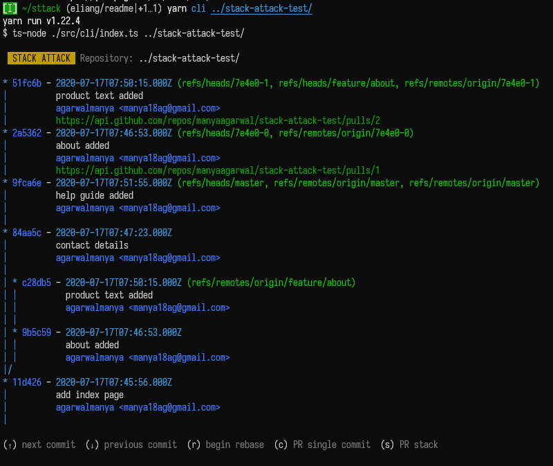
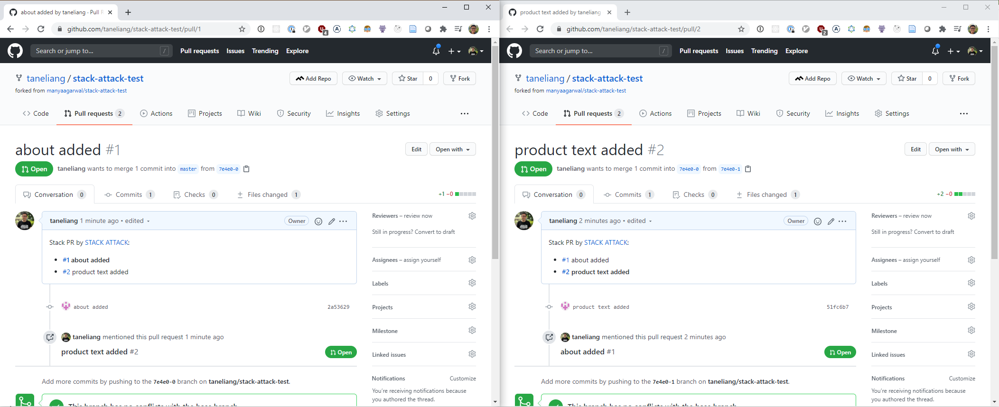
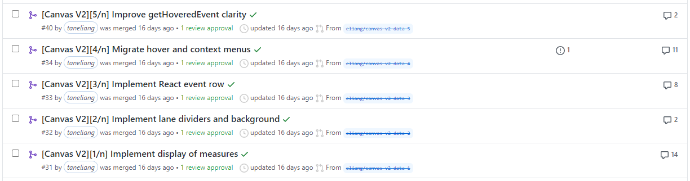
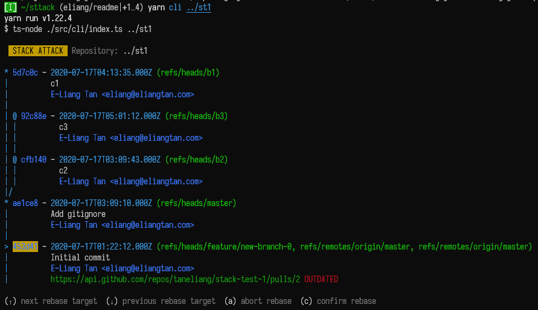

# Stack Attack

Stack Attack is a CLI tool that helps you work with stacked pull requests.
Stacking PRs is now ~~a piece~~ many small pieces of cake.

Demo video:

[](https://www.youtube.com/watch?v=pLGN2sMuC0w)

## Problem

Although big PRs are common in the GitHub ecosystem, there are many problems
with them:

- Big PRs are hard to review as it is hard to follow the many logic changes in a
  large diff. As the code review process is not going to be as effective, there
  is a higher chance that bugs get merged and deployed into production.
- Big PRs take some time to write, potentially causing integration issues both
  on the base branch and in the PR as the project evolves around it.

Are small PRs the solution? YES.

However, small PRs are difficult to deal with on GitHub. Some issues include:

- Small PRs result in a faster PR cadence. Without an easy and systematic way to
  build PRs on each other (while the PR author waits for a PR review) and manage
  their dependencies, the PRs quickly become unmanageable.
- Updates to earlier PRs or the base branch will require many individual rebases
  of every PR in the dependency stack.

## Stacked PRs?

Instead of implementing a feature in a single large PR, Stack Attack lets you
build a feature incrementally in a stack of PRs. Specifically, Stack Attack
helps you to create, manipulate, and land these PR stacks.


Stack Attack is inspired by Facebook's internal source management and IDE GUI
tools, and implements their workflow for everyone else.

### Principles

- **A stacked PR has exactly one commit.** A commit can only get to a certain
  size before it gets confusing and unmanageable to even you. This is a good
  thing – if a diff is too big for you, splitting it into multiple commits
  solves the problem for you but not for the reviewer.
- **A stacked PR implements one small thing completely.** When a PR has a
  single, well-defined goal, code reviewers can more easily review your code,
  allowing you to land your code faster.
- **A stacked PR is fully functional and only depends on its base branch and
  other PRs stacked below it.** In other words, a partial PR stack should be
  able to be landed without breaking the base branch. This allows early PRs in
  the PR stack to be landed while work on their dependent PRs continue, allowing
  all developers to detect integration issues early.

  

### Limitations

- As a feature is now implemented across multiple PRs, it can be hard to get an
  overview of what the PR stack achieves. PRs are also no longer a suitable
  place for higher level discussions. Discussions that occur in a PR early in a
  stack will also likely not be seen or remembered by those reviewing later PRs.
  These can be mitigated by moving high level discussions to other tools such as
  GitHub Issues.
- Reviewers can no longer consider a PR individually, but they have to also
  consider the changes in later PRs stacked on top of it. If done inefficiently,
  this can lead to unnecessary comments on earlier PRs that already have
  solutions in later PRs, or long review processes that review the stack as a
  whole (and defeating the point of using stacked PRs). This can be mitigated by
  the following:
  - Adding TODO comments in earlier PRs where later code is expected to go.
  - Defining the scope of a PR in its description.
  - Describing how later PRs are expected to stack on top of a PR. This includes
    highlighting known issues/hacks/limitations and plans to address them.
  - Providing context by linking to relevant discussions/issues in every PR in
    the stack.
- Rebase conflicts are still a thing. This can be mitigated by reviewing PRs
  promptly and landing PRs frequently. Project maintainers may also consider
  allowing contributors to address review comments in a new PR on top of the
  stack.
- Stack Attack only works with Git and GitHub. (Sorry!)

### Non-goals

- Stacked PRs do not replace single PRs. There are many good reasons to use
  single PRs, e.g. for small or automated tasks. What Stack Attack gives you is
  the additional ability to use stacked PRs when the situation calls for it.

## Usage

### From NPM

1. Add a `<repo_path>/sttack.config.json` file, where `<repo_path>` is the local
   path to the repository you want to run Stack Attack on. The config file
   should contain the following:

   ```jsonc
   {
     "personalAccessToken": "<your GitHub personal access token>",

     // Provide an SSH key so that we can push your code to GitHub.
     "userPublicKeyPath": "<absolute path to your SSH public key>", // e.g.: /Users/phuonganh/.ssh/id_rsa.pub
     "userPrivateKeyPath": "<absolute path to your SSH private key>", // e.g.: /Users/phuonganh/.ssh/id_rsa"
     "userPassphrase": "<SSH key passphrase>" // Leave empty if no passphrase
   }
   ```

   Note: You can generate a GitHub personal access token
   [here](https://github.com/settings/tokens).

1. Install Stack Attack by running:

   ```sh
   yarn global add sttack
   # OR
   npm install -g sttack
   ```

1. Run `sttack` in your repository to start Stack Attack!

### From Source

1. Clone this repository.
1. Run `yarn` to install our dependencies.
1. Create a `<repo_path>/sttack.config.json` file as above.
1. Run `yarn cli [repo_path]` to start Stack Attack.

### General Tips

1. Roughly plan your implementation steps before starting to code. It is much
   harder to split a completed feature into a PR stack than to incrementally
   build up a PR stack.
1. Create and land PRs frequently to get early reviewer feedback. Although you
   can update a PR early in the stack and rebase later PRs on top of it, you'll
   still want to minimize the chance of facing conflicts when rebasing.
1. Review PRs starting from the base of the stack. When working with a large PR
   stack, it can be frustrating to have all PRs approved except for the very
   first one, blocking the entire stack from being landed.
1. In many situations, it may help to gate the new code behind a feature flag
   while it is being worked on. This lets you land incomplete features (e.g. a
   modal with just placeholder text) safely without breaking the app in
   production.

### Workflows

Below are some common workflows that Stack Attack supports.

As Stack Attack is in an early phase of development, many essential features are
not yet implemented. Nevertheless, to communicate our vision for Stack Attack,
we've listed these unimplemented workflows together with those that are
implemented. Please reach out if you'd like to help make them a reality!

#### Creating a PR stack

1. Navigate to the base of the commit stack.
1. Press `s` to create the PR stack.



A PR will be created for each commit in the stack.

#### Navigating a PR stack on GitHub

Every PR references other PRs in the the same stack.

[](https://github.com/taneliang/stack-attack-test/pull/1)

**Protip:** Use commit naming conventions to help you identify the bigger
feature the stack is building towards. At Facebook, Diffs belonging to stacks
are often numbered. Here are some common patterns:

- `[<large feature name>][<PR number in the stack>/<total number of PRs in the stack, or just "n">] <commit title>`
- `<large feature name> (<PR number in the stack>/<total number of PRs in the stack, or just "n">): <commit title>`
- `<large feature name> (Part <PR number in the stack>)`

Some examples of such numbered commits:

- [Input form redesign][1/n] Create new fork of existing code
- V2 data migration (3/n): Remove V1 types
- Add type annotations (Part 1)

Numbered PRs in the wild:

[](https://github.com/MLH-Fellowship/scheduling-profiler-prototype/pull/31)

#### Rebasing commits belonging to a PR stack

In a manually-managed PR stack, rebasing is tedious as every PR's branch needs
to be rebased individually.

Stack Attack treats rebasing as a transplanting of a commit tree. As such, with
Stack Attack, you can rebase a stack of commits in just a few keyboard commands.



1. Navigate to the base of the commit tree you want to rebase/transplant.
1. Press `r` to begin rebasing.
1. Navigate to the target commit you want to rebase the commit stack on.
1. Press `c` to confirm the rebase. The commits in the stack will be rebased,
   and all the local branches pointing to them will be moved along.
1. (Envisioned) If PRs have already been created for the previous commits, press
   `s` to update the PRs in the PR stack.

#### Amending PRs in a PR stack (envisioned)

1. Checkout the commit to be amended.
1. Make your changes.
1. In Stack Attack, press `a` to amend the commit. All the commits stacked on
   top of it will be rebased onto the new commit.
1. If PRs have already been created for the previous commits, press `s` to make
   a new PR for the PR stack.

#### Adding PRs on top of an existing PR stack (envisioned)

1. Create the new commit at the top of the commit stack using your regular Git
   tools.
1. In Stack Attack, navigate to the new commit.
1. Press `s` to make a new PR for the commit.

#### Inserting a new PR into an existing PR stack (envisioned)

1. Checkout a commit you want to build on.
1. Make your changes, then create a new commit using your regular Git tools.
1. In Stack Attack, rebase the later commits in the stack onto the new commit.
1. Navigate to the new commit.
1. Press `s` to make a new PR for the commit.

#### Landing a complete PR stack (envisioned)

TODO

#### Landing part of a PR stack (envisioned)

TODO

## Inspiration

- Facebook’s internal Diff stacks.
- https://github.com/ezyang/ghstack

## Built With

- [Node.js](https://nodejs.org/en/) :computer: - A JavaScript runtime built on
  Chrome's V8 JavaScript engine.
- [Git](https://www.git-scm.com/doc) :smile: - Version Control Management
- [TypeScript](https://www.typescriptlang.org/) :heart: - Semantics

## Contributors

Thanks goes to these wonderful people:

<!-- ALL-CONTRIBUTORS-LIST:START - Do not remove or modify this section -->
<!-- prettier-ignore-start -->
<!-- markdownlint-disable -->
<table>
  <tr>
    <td align="center"><a href="https://github.com/taneliang"><br /><sub>
    <a href="https://github.com/taneliang" title="Frontend/Backend">E-Liang Tan</a> </sub></a><br />
    <td align="center"><a href="https://github.com/manyaagarwal"><br /><sub>
    <a href="https://github.com/manyaagarwal" title="Github Integration">Manya Agarwal</a></sub></a><br /> 
    <td align="center"><a href="https://github.com/jessieAnhNguyen"><br /><sub>
    <a href="https://github.com/jessieAnhNguyen" title="Github Integration">Jessie Anh</a></sub></a><br /> 
    <td align="center"><a href="https://github.com/saphal1998"><br /><sub>
    <a href="https://github.com/saphal1998" title="Local Git">Saphal Patro</a></sub></a><br /> 
  </tr>
</table>

<!-- markdownlint-enable -->
<!-- prettier-ignore-end -->

<!-- ALL-CONTRIBUTORS-LIST:END -->
